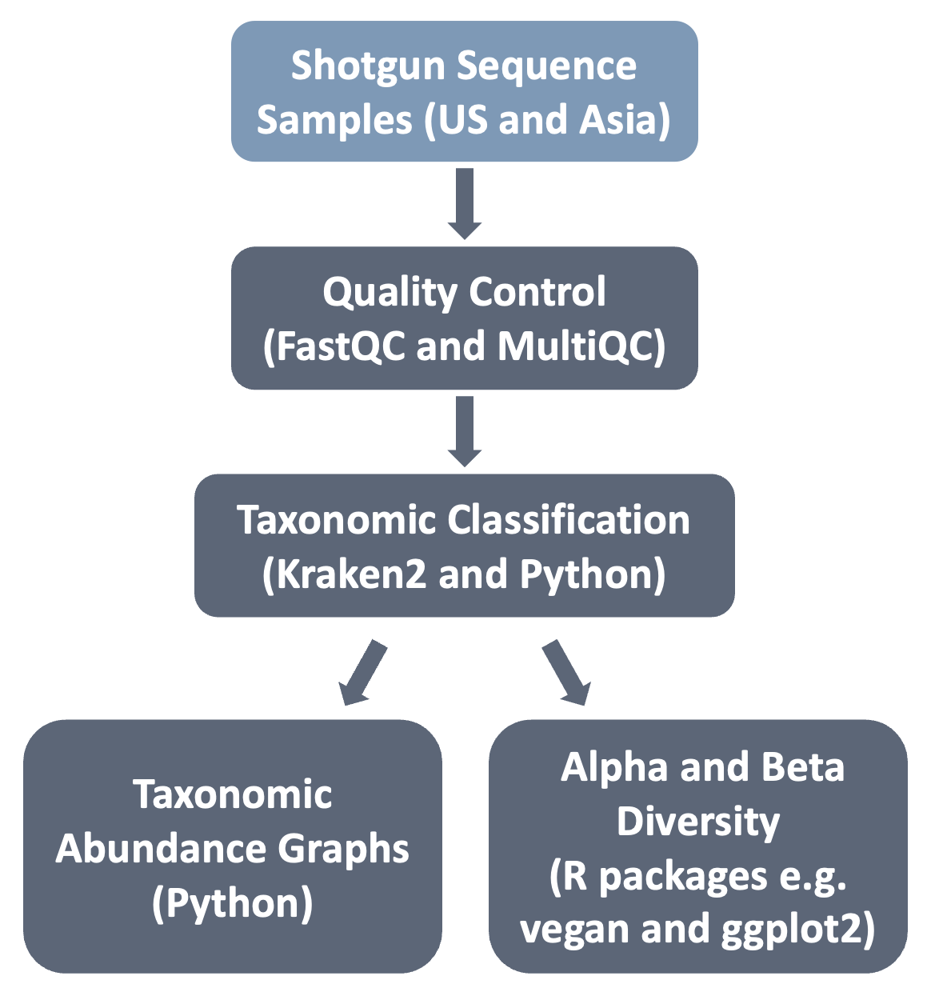

## Illuminating the Effects of Geographic Location Upon Vaginal Microbiota Composition

In the field of human microbiome, studies into the human gut composition are prevalent due to the fact that gut bacteria contribute to making energy resources available through their metabolism (ei. lactose) and protect against potential pathogens. These benefits are not constrained to the gut and are seen along the whole human body, especially in the female vagina. 

Research labs have explored vaginal microbiota metagenomes and provided significant insights into what influences vaginal microbiota composition as well as their impact on human health. For instance, in the metagenomics study done by Li et al. 2024 found that asian individuals found at high-altitude had increased species diversity, depletion of Lactobacillus crispatus, and more anaerobic bacteria in comparison to women that live at sea level. Furthermore, France et al. 2022 conducted research with women from the US to further understand vaginal community structure and their metabolic contributions through metagenomics and metatranscriptomics. Their work found that different lactobacilli species dominate the community composition and their transcriptomic profile varies as the community composition changes. 

While both Li et al. 2024 and France et al. 2022 make important contributions to vaginal metagenomics, they failed to also take into account the impact distinct geographical locations can have upon vaginal bacterial composition. To make up for this hole in their analysis, we would utilize the shotgun sequences provided by these two papers to do sequence and post-sequencing analysis to group sequences by taxonomy. Our aim is to evaluate the changes in relative abundance of vaginal bacteria according to geographic location.

Kraken2 (Wood et al. 2014) was used to assign taxonomic labels to metagenomic data and calculate the absolute abundances of reads in samples from Li et al. 2024 and France et al. 2022. Python and R were used to do relative abundance analysis, determining alpha and beta diversity, and PCoA.

