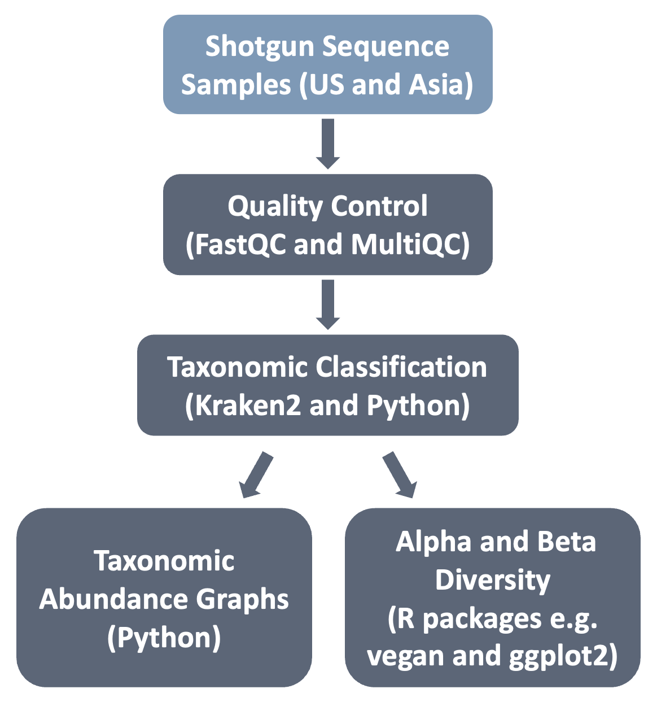

## Illuminating the Effects of Geographic Location Upon Vaginal Microbiota Composition

In the field of human microbiome, studies into the human gut composition are prevalent. Beyond human gut microbiota research labs have explored vaginal microbiota metagenomes and provided significant insights into what influences vaginal microbiota composition. For instance, in the metagenomics study done by Li et al. 2024 (research participants from Asia) and France et al. 2022 (research participants from the United States), they both observed how different factors influence vaginal composition (such as elevation). However, they failed to also take into account the impact distinct geographical locations can have upon vaginal bacterial composition. To make up for this hole in their analysis, we would utilize the shotgun sequences provided by these two papers to do sequence and post-sequencing analysis to group sequences by taxonomy. Our aim is to evaluate the changes in relative abundance of vaginal bacteria according to geographic location.

